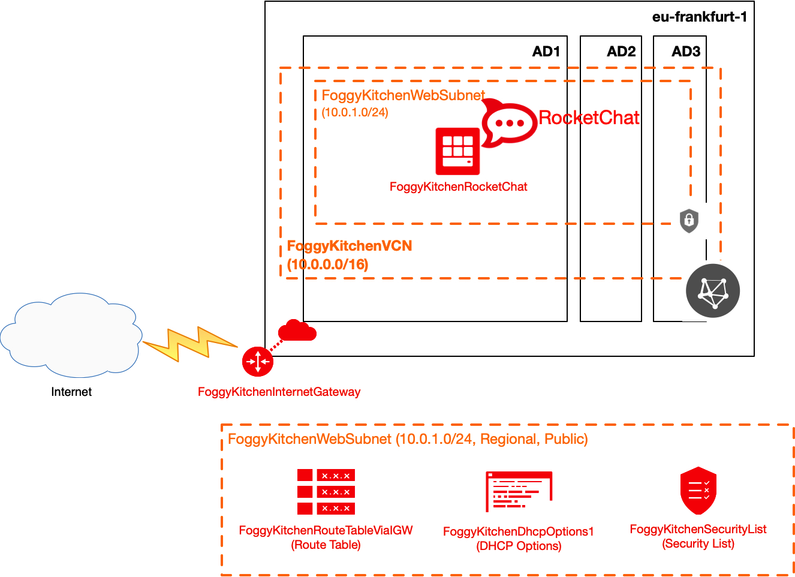

# Terraform OCI Marketplace

## Project description

In this repository I have documented my hands-on experience with Terrafrom for the purpose of deploying RocketChat image from OCI Marketplace. This set of HCL based Terraform files can customized according to any requirements.  

## Topology Diagram 

With the usage of this example HCL code you can build topology documented by diagram below. This topology is extremly simplified for education purposes and rather cannot be used for production implementations. 



## How to use code 

### STEP 1.

Clone the repo from github by executing the command as follows and then go to terraform-oci-marketplace directory:

```
[opc@terraform-server ~]$ git clone https://github.com/mlinxfeld/terraform-oci-maketplace.git
Cloning into 'terraform-oci-maketplace'...
remote: Enumerating objects: 45, done.
remote: Counting objects: 100% (45/45), done.
remote: Compressing objects: 100% (31/31), done.
remote: Total 45 (delta 19), reused 40 (delta 14), pack-reused 0
Unpacking objects: 100% (45/45), done.

[opc@terraform-server ~]$ cd terraform-oci-maketplace/

[opc@terraform-server terraform-oci-maketplace]$ ls -latr
total 1044
drwxr-xr-x  44 opc  opc  1408 20 maj 12:36 ..
-rw-r--r--   1 opc  opc   400 20 maj 13:05 route.tf
-rw-r--r--   1 opc  opc   684 20 maj 13:05 security_list.tf
-rw-r--r--   1 opc  opc   470 20 maj 13:05 subnet1.tf
-rw-r--r--   1 opc  opc   219 20 maj 13:05 internet_gateway.tf
-rw-r--r--   1 opc  opc   411 20 maj 13:05 dhcp_options.tf
-rw-r--r--   1 opc  opc   228 20 maj 13:33 provider.tf
-rw-r--r--   1 opc  opc   323 21 maj 12:04 vcn.tf
-rw-r--r--   1 opc  opc  4417 21 maj 14:50 marketplace.tf
-rwxr-xr-x   1 opc  opc  1281 21 maj 14:56 rocketchatserver.tf
-rw-r--r--   1 opc  opc   418 21 maj 15:12 variables.tf
drwxr-xr-x  12 opc  opc   384 21 maj 15:26 .git
drwxr-xr-x  14 opc  opc   448 22 maj 10:11 .
-rw-r--r--@  1 opc  opc  8191 22 maj 10:11 README.md

```

### STEP 2.

Within web browser go to URL: https://www.terraform.io/downloads.html. Find your platform and download the latest version of your terraform runtime. Add directory of terraform binary into PATH and check terraform version:

```
[opc@terraform-server terraform-oci-maketplace]$ export PATH=$PATH:/home/opc/terraform

[opc@terraform-server terraform-oci-maketplace]$ terraform --version

Terraform v0.12.16

Your version of Terraform is out of date! The latest version
is 0.12.17. You can update by downloading from https://www.terraform.io/downloads.html
```

### STEP 3. 
Next create environment file with TF_VARs:

```
[opc@terraform-server terraform-oci-private-atp]$ vi setup_oci_tf_vars.sh
export TF_VAR_user_ocid="ocid1.user.oc1..aaaaaaaaob4qbf2(...)uunizjie4his4vgh3jx5jxa"
export TF_VAR_tenancy_ocid="ocid1.tenancy.oc1..aaaaaaaas(...)krj2s3gdbz7d2heqzzxn7pe64ksbia"
export TF_VAR_compartment_ocid="ocid1.tenancy.oc1..aaaaaaaasbktyckn(...)ldkrj2s3gdbz7d2heqzzxn7pe64ksbia"
export TF_VAR_fingerprint="00:f9:d1:41:bb:57(...)82:47:e6:00"
export TF_VAR_private_key_path="/tmp/oci_api_key.pem"
export TF_VAR_region="eu-frankfurt-1"
export TF_VAR_private_key_oci="/tmp/id_rsa"
export TF_VAR_public_key_oci="/tmp/id_rsa.pub"


[opc@terraform-server terraform-oci-maketplace]$ source setup_oci_tf_vars.sh
```

### STEP 4.
Run *terraform init* with upgrade option just to download the lastest neccesary providers:

```
[opc@terraform-server terraform-oci-maketplace]$ terraform init -upgrade

Initializing the backend...

Initializing provider plugins...
- Checking for available provider plugins...
- Downloading plugin for provider "oci" (hashicorp/oci) 3.76.0...

Terraform has been successfully initialized!

You may now begin working with Terraform. Try running "terraform plan" to see
any changes that are required for your infrastructure. All Terraform commands
should now work.

If you ever set or change modules or backend configuration for Terraform,
rerun this command to reinitialize your working directory. If you forget, other
commands will detect it and remind you to do so if necessary.
```

### STEP 5.
Run *terraform apply* to provision the content of this code (type **yes** to confirm the the apply phase):

```
[opc@terraform-server terraform-oci-maketplace]$ terraform apply 

An execution plan has been generated and is shown below.
Resource actions are indicated with the following symbols:
  + create
 <= read (data resources)

Terraform will perform the following actions:

  # data.oci_core_vnic.FoggyKitchenRocketChat_VNIC1 will be read during apply
  # (config refers to values not yet known)

(...)

Plan: 11 to add, 0 to change, 0 to destroy.

Do you want to perform these actions?
  Terraform will perform the actions described above.
  Only 'yes' will be accepted to approve.


(...)

Apply complete! Resources: 11 added, 0 changed, 0 destroyed.

Outputs:

FoggyKitchenRocketChat_PublicIP = [
  "158.101.165.174",

(...)

```

### STEP 6.
Wait 2-3 minutes and try to access RocketChat from the web browser:

```
[opc@terraform-server terraform-oci-maketplace]$ curl http://158.101.165.174:3000/

```

### STEP 7.
After testing the environment you can remove the whole OCI infra. You should just run *terraform destroy* (type **yes** for confirmation of the destroy phase):

```
[opc@terraform-server terraform-oci-maketplace]$ terraform destroy

oci_core_virtual_network.FoggyKitchenVCN: Refreshing state... [id=ocid1.vcn.oc1.eu-frankfurt-1.amaaaaaadngk4giauouhqozbrtagic6btzcotrfpikf2vuqhlecpcxfska4q]
data.oci_marketplace_listings.FoggyKitchen_Listings: Refreshing state...
data.oci_identity_availability_domains.ADs: Refreshing state...
oci_core_dhcp_options.FoggyKitchenDhcpOptions1: Refreshing state... [id=ocid1.dhcpoptions.oc1.eu-frankfurt-1.aaaaaaaa4kxj5e55ek7yqy3uk3vrxdlpbttrt3fl4cr7weqt5dfnl4oo6x3q]
(...)

Plan: 0 to add, 0 to change, 11 to destroy.

Do you really want to destroy all resources?
  Terraform will destroy all your managed infrastructure, as shown above.
  There is no undo. Only 'yes' will be accepted to confirm.

  Enter a value: yes

(...)

oci_core_app_catalog_subscription.FoggyKitchen_App_Catalog_Subscription: Destruction complete after 15s
oci_core_app_catalog_listing_resource_version_agreement.FoggyKitchen_App_Catalog_Listing_Resource_Version_Agreement: Destroying... [id=2020-05-21 13:06:02.844 +0000 UTC]
oci_core_app_catalog_listing_resource_version_agreement.FoggyKitchen_App_Catalog_Listing_Resource_Version_Agreement: Destruction complete after 0s

Destroy complete! Resources: 11 destroyed.

```
